# 📦 Inventory & Order Management Platform

<p align="center">


</p>

A production-ready backend Inventory & Order Management Platform built with **FastAPI**, **PostgreSQL**, **SQLAlchemy**, **Alembic**, **Redis**, **Celery**, **JWT Authentication**, and **Docker**.

The platform provides secure REST APIs for inventory operations, warehouse management, supplier management, purchase orders, stock transfers, customer orders, authentication, reporting, and audit logging.

---

# 🚀 Features

## 🔐 Authentication & Authorization

- JWT Authentication
- Refresh Tokens
- Role-Based Access Control (RBAC)
- Password Hashing
- Protected APIs
- User Management

---

## 📦 Product Management

- Product CRUD
- Category CRUD
- SKU Management
- Product Status
- Search & Filtering

---

## 🏬 Warehouse Management

- Warehouse CRUD
- Multi-Warehouse Support
- Warehouse Status

---

## 📊 Inventory Management

- Inventory Tracking
- Inventory Ledger
- Stock In
- Stock Out
- Stock Adjustments
- Available Quantity Calculation
- Inventory Reports

---

## 🚚 Supplier Management

- Supplier CRUD
- Contact Information
- Supplier Status

---

## 📝 Purchase Orders

- Purchase Order Creation
- Purchase Order Status
- Inventory Receiving
- Supplier Integration

---

## 🔄 Stock Transfers

- Warehouse-to-Warehouse Transfers
- Transfer Approval
- Inventory Synchronization

---

## 🛒 Customer Orders

- Customer CRUD
- Order Creation
- Order Status Workflow
- Order Validation

---

## 📈 Reports

- Inventory Reports
- Warehouse Reports
- Product Reports
- Order Reports

---

## ⚙️ Developer Features

- OpenAPI Documentation
- Swagger UI
- ReDoc
- Docker Support
- Alembic Migrations
- GitHub Actions CI
- Environment-based Configuration
- Structured Logging

---

# 🏗 System Architecture

```
                Client / Frontend
                        │
                        ▼
                 FastAPI REST API
                        │
      ┌─────────────────┼─────────────────┐
      ▼                 ▼                 ▼
 Authentication     Business Logic    Background Jobs
                        │                 Celery
                        ▼
                  Repository Layer
                        │
                  SQLAlchemy ORM
                        │
                 PostgreSQL Database
```

---

# 🛠 Technology Stack

| Category | Technologies |
|----------|--------------|
| Language | Python |
| Framework | FastAPI |
| ORM | SQLAlchemy |
| Database | PostgreSQL |
| Authentication | JWT |
| Password Hashing | Passlib |
| Cache | Redis |
| Background Jobs | Celery |
| Database Migration | Alembic |
| Containerization | Docker |
| Testing | Pytest |
| CI/CD | GitHub Actions |

---

# 📂 Project Structure

```
Inventory-Order-Management
│
├── app
│   ├── api
│   ├── core
│   ├── db
│   ├── middleware
│   ├── models
│   ├── repositories
│   ├── schemas
│   ├── services
│   ├── utils
│   └── main.py
│
├── alembic
├── docs
├── scripts
├── tests
│
├── Dockerfile
├── docker-compose.yml
├── requirements.txt
├── alembic.ini
└── README.md
```

---

# 📚 API Documentation

After running the application:

Swagger UI

```
http://localhost:8000/docs
```

ReDoc

```
http://localhost:8000/redoc
```

---

# ⚙️ Local Setup

Clone repository

```bash
git clone https://github.com/saiarvindcs/Inventory-Order-Management.git
```

Go into project

```bash
cd Inventory-Order-Management
```

Create virtual environment

```bash
python -m venv .venv
```

Activate

### Windows

```powershell
.venv\Scripts\activate
```

### Linux / macOS

```bash
source .venv/bin/activate
```

Install packages

```bash
pip install -r requirements.txt
```

Create environment file

```bash
cp .env.example .env
```

Run database migrations

```bash
alembic upgrade head
```

Start server

```bash
uvicorn app.main:app --reload
```

---

# 🐳 Docker

```bash
docker compose up --build
```

---

# 🧪 Running Tests

```bash
pytest
```

---

# 🔐 Security

- JWT Authentication
- Password Hashing
- Role-Based Access Control
- Request Validation
- Environment Variables
- Protected Endpoints

---

# 🚀 Future Enhancements

- Payment Gateway Integration
- Advanced Inventory Forecasting
- Event-Driven Architecture
- Kubernetes Deployment
- Distributed Caching
- Notification Service
- Real-time Inventory Updates
- Analytics Dashboard

---

---

# 📸 Application Screenshots

## Dashboard

### Dashboard Overview

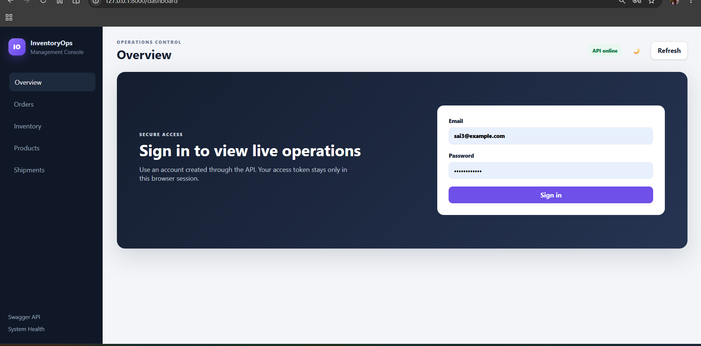

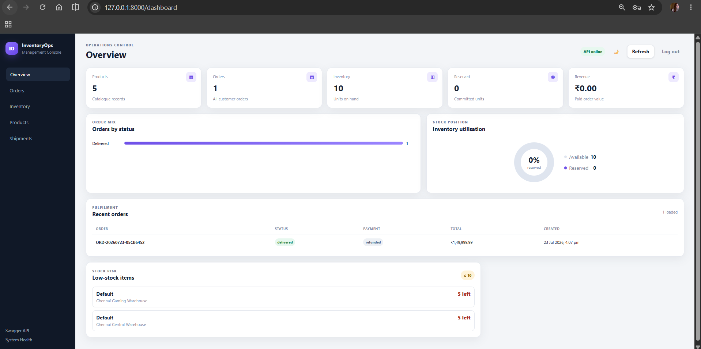

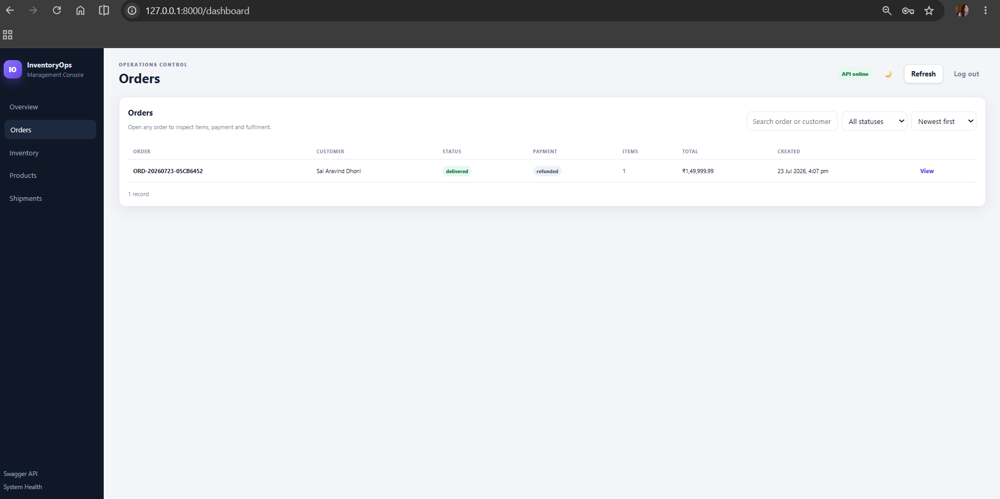

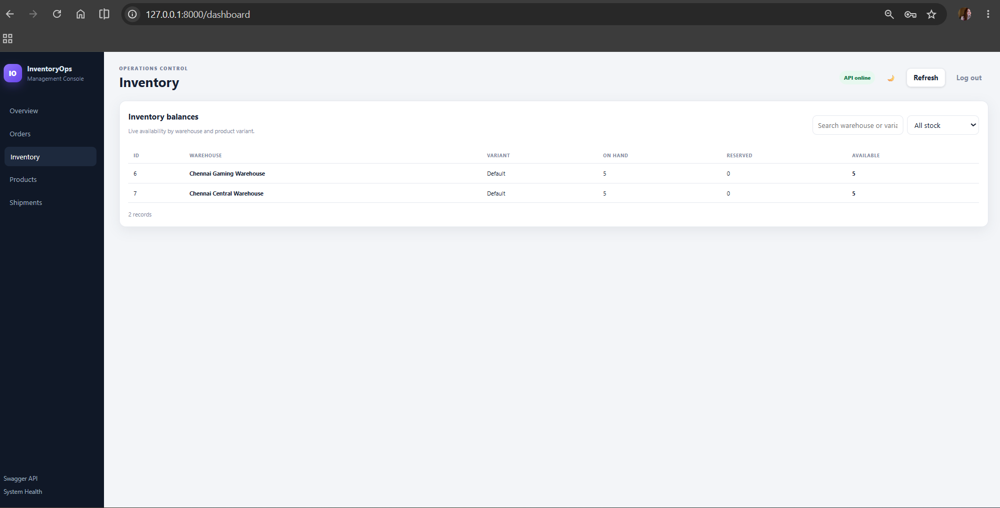

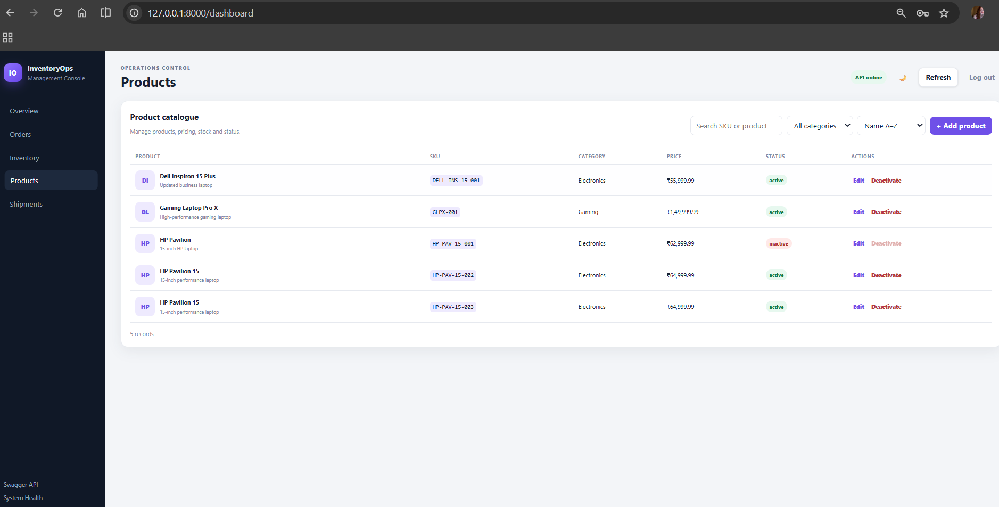

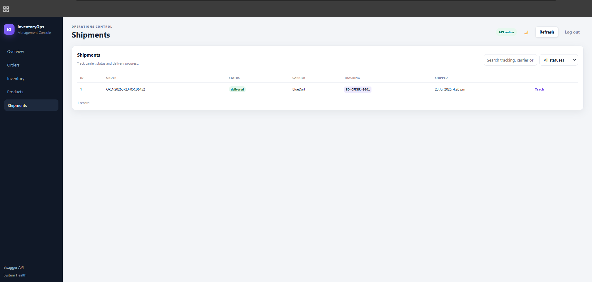

---

# 📖 Swagger API Documentation

### Swagger Documentation (Part 1)

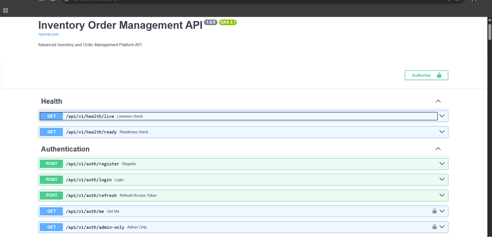

---

### Swagger Documentation (Part 2)

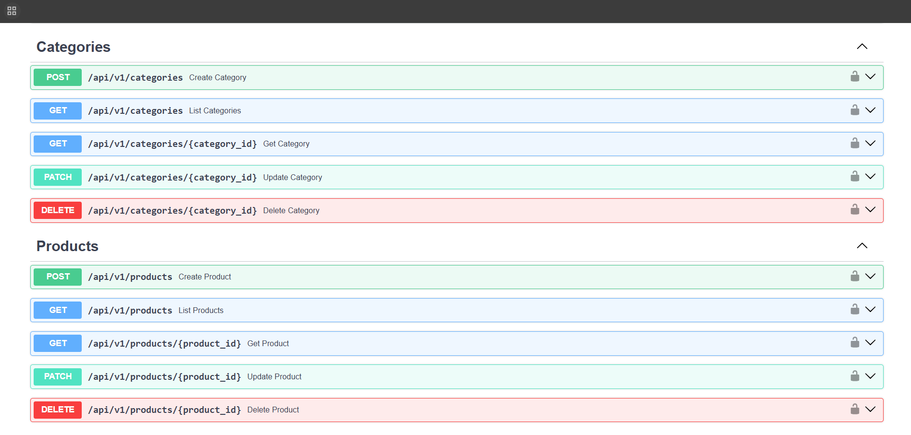

---

### Swagger Documentation (Part 3)

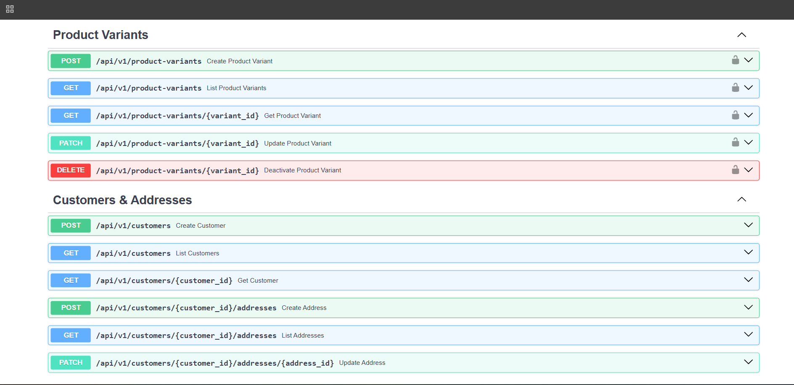

---

### Swagger Documentation (Part 4)

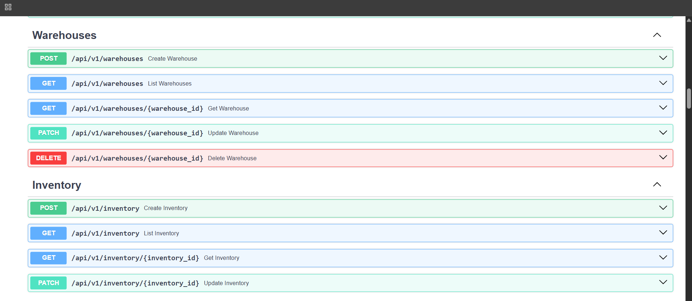

---

### Swagger Documentation (Part 5)

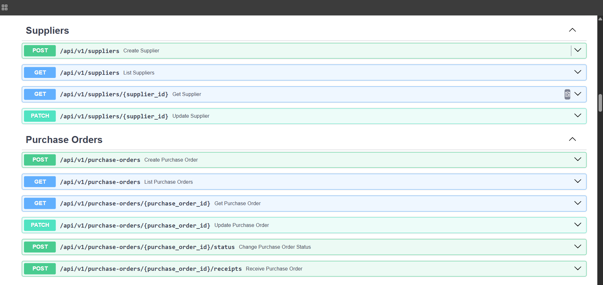

---

### Swagger Documentation (Part 6)

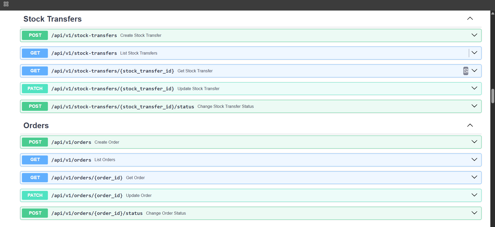

---

### Swagger Documentation (Part 7)

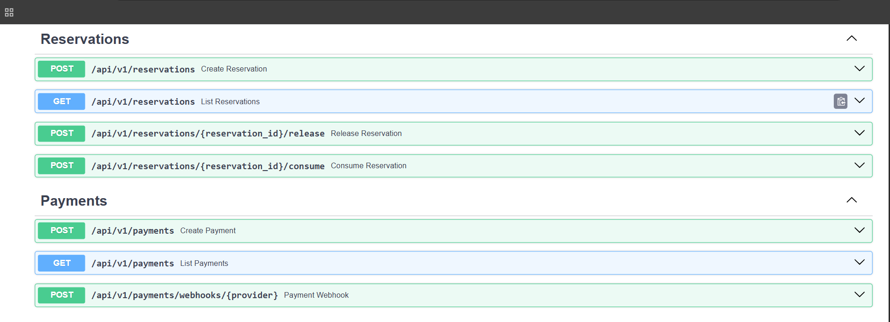

---

### Swagger Documentation (Part 8)

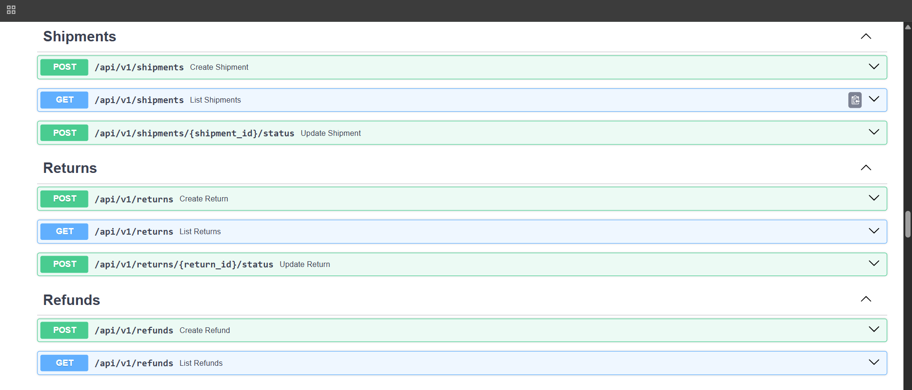

---

### Swagger Documentation (Part 9)

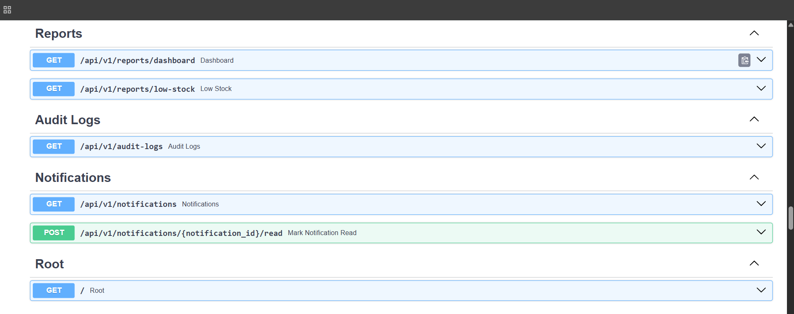

---

### Swagger Documentation (Part 10)

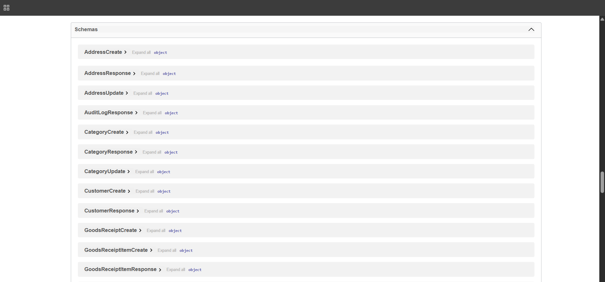


# 👨‍💻 Author

**Sai Aravind**

Backend Developer

GitHub:
https://github.com/saiarvindcs

---

## ⭐ If you found this project useful, consider giving it a Star!
